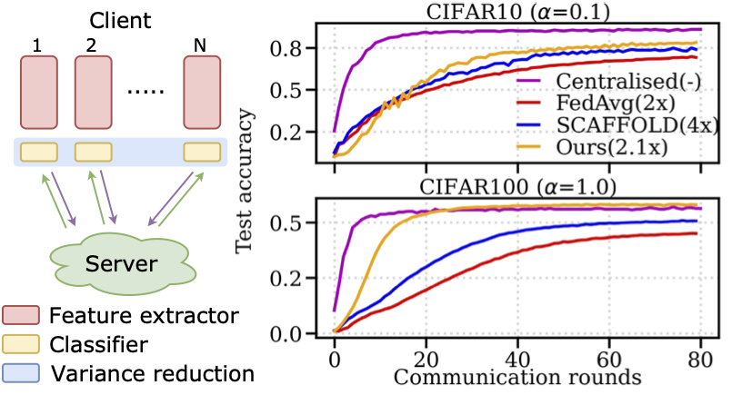

### Partial Variance Reduction improves Non-Convex Federated learning on heterogeneous data
This repository provides the implementation for our paper [Partial Variance Reduction improves Non-Convex Federated learning on heterogeneous data](https://arxiv.org/pdf/2212.02191.pdf). 




#### Requirement 
```bash
git clone https://github.com/lyn1874/fedpvr.git
cd fedpvr
conda env create -f fedpvr.yaml
conda activate torch_dl
```

#### Data preparation

The real CIFAR10 and CIFAR100 data are downloaded and stored under `../image_dataset/` by default. To change this, please modify the `data_path` argument in `configs.conf.py` file.

#### Path preparation
Define the corresponding path in function `get_replace_for_init_path()` and `get_path_init()` in file `utils.utils.py`

#### Training
We train fedavg using the following command
```bash
./run_fedavg_scaffold_fedpvr.sh gpu_device data '0' N location aggregation 
gpu_device: int
data: cifar10/cifar100
N: int, number of devices
location: str, defines the location for saving the experiment
aggregation: fed_avg/scaffold/fed_pvr 
```
For other aggregation methods, please have a look at file `run_fedprox.sh` and `run_fed_dyn.sh`.


#### Citation
If you use this code, please cite:
```
@InProceedings{Li_2023_CVPR,
    author    = {Li, Bo and Schmidt, Mikkel N. and Alstr{\o}m, Tommy S. and Stich, Sebastian U.},
    title     = {On the Effectiveness of Partial Variance Reduction in Federated Learning With Heterogeneous Data},
    booktitle = {Proceedings of the IEEE/CVF Conference on Computer Vision and Pattern Recognition (CVPR)},
    month     = {June},
    year      = {2023},
    pages     = {3964-3973}
}
```
